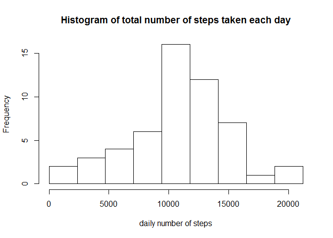
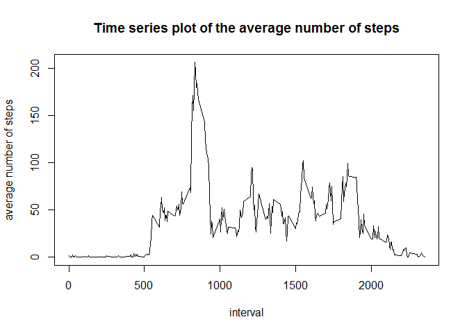
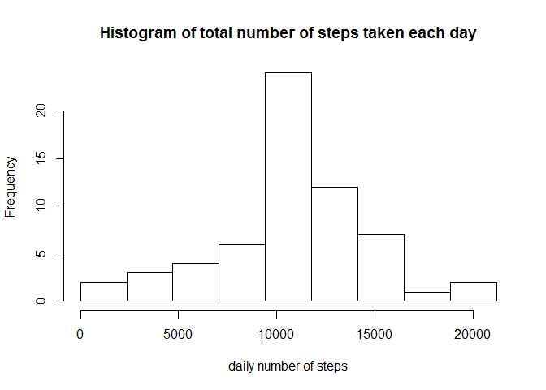
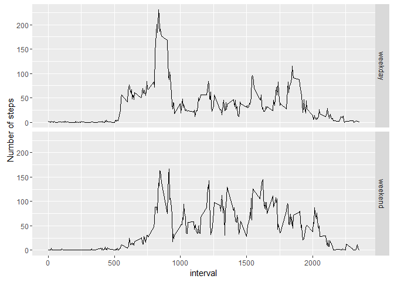

# Reproducible Research: Peer Assessment 1


## Loading and preprocessing the data

```r
# load data to activity
activity <- read.csv("activity.csv")
# convert column date to Date format
activity$date <- as.Date(as.character(activity$date))
```


## What is mean total number of steps taken per day?

```r
dailySteps <- tapply(activity$steps, activity$date, sum, rm.na=TRUE)
# plot the histogram of the total number of steps taken each day
hist(dailySteps, 
     breaks=seq(0,max(dailySteps, na.rm=TRUE), l=10),
     main="Histogram of total number of steps taken each day", 
     xlab="daily number of steps")
```

<!-- -->

```r
# calculate mean number of steps taken each day ignoring the missing values
mean(dailySteps, na.rm=TRUE)
```

```
## [1] 10767.19
```

```r
# calculate median number of steps taken each day ignoring the missing values
median(dailySteps, na.rm=TRUE)
```

```
## [1] 10766
```


## What is the average daily activity pattern?

```r
# average steps over date
avgSteps <- tapply(activity$steps, activity$interval, 
                           mean, na.rm=TRUE)
avgSteps <- data.frame(interval=as.integer(names(avgSteps)), 
                       steps=unname(avgSteps))

# Time series plot of the average number of steps taken
with(avgSteps, plot(interval, steps, type="l", 
        main = 'Time series plot of the average number of steps', 
                    ylab = 'average number of steps'))
```

<!-- -->

```r
# output the 5-minute interval having the maximum number of steps
avgSteps[which.max(avgSteps$steps)[1],"interval"]
```

```
## [1] 835
```


## Imputing missing values

```r
# calculate the total number of missing values in the dataset
sum(is.na(activity$steps))
```

```
## [1] 2304
```

```r
# calculate the percentage of missing values in the dataset
mean(is.na(activity$steps))
```

```
## [1] 0.1311475
```

```r
# fill the missing values with the mean for that 5-minute interval
library(dplyr)
```

```
## 
## Attaching package: 'dplyr'
```

```
## The following objects are masked from 'package:stats':
## 
##     filter, lag
```

```
## The following objects are masked from 'package:base':
## 
##     intersect, setdiff, setequal, union
```

```r
activity$steps_filled <- activity$steps
for(i in 1:nrow(activity)) {
    if(is.na(activity[i,'steps'])) {
        interval = activity[i,'interval']
        activity[i,'steps_filled'] <-
            avgSteps[which(avgSteps$interval==interval),]$steps
    }
}

dailySteps <- tapply(activity$steps_filled, activity$date, 
                     sum)

# Histogram of the total number of steps taken each day after missing values are imputed
hist(dailySteps, 
     breaks=seq(0,max(dailySteps), l=10),
     main="Histogram of total number of steps taken each day", 
     xlab="daily number of steps")
```

<!-- -->

```r
# calculate mean number of steps taken each day imputing the missing values
mean(dailySteps)
```

```
## [1] 10766.19
```

```r
# calculate median number of steps taken each day imputing the missing values
median(dailySteps)
```

```
## [1] 10766.19
```

The mean and median total number of steps taken per day after imputing the missing values are slightly differnent from that in the first part. But the differences are very small.

## Are there differences in activity patterns between weekdays and weekends?

```r
library(dplyr)
library(ggplot2)

# Create a new factor variable in the dataset with 
# two levels - "weekday" and "weekend" indicating 
# whether a given date is a weekday or weekend day
activity <- mutate(activity, weekday = 
                ifelse(weekdays(date, abbr = TRUE) 
                       %in% c("Sat", "Sun"), 
                    "weekend", 
                    "weekday"))

# calculate steps taken at each interval averaged on weekday and weekend
act_by_weekday <- activity %>%
    group_by(weekday, interval) %>%
    summarise(mean_steps = mean(steps_filled)) %>%
    ungroup() %>%
    arrange(interval)

# Make a panel plot containing a time series plot of the 5-minute interval (x-axis) and the average number of steps taken, averaged across all weekday days or weekend days (y-axis)
qplot(interval, mean_steps, data=act_by_weekday, 
      geom = "line", ylab = 'Number of steps',
      facets=weekday~.)
```

<!-- -->

The activity patterns between weekdays and weekends have noticable differences. From interval 500 to 730, there are more steps taken during weekday. It means that the tester gets up earlier in weekday than in weekend.  However, from interval 2000 to 2100, there are less steps taken during weekday. It means that on average, the tester rests earlier in weekday than in weekend. From 1000 to 1730, the tester is more active in weekday than in weekend.  
